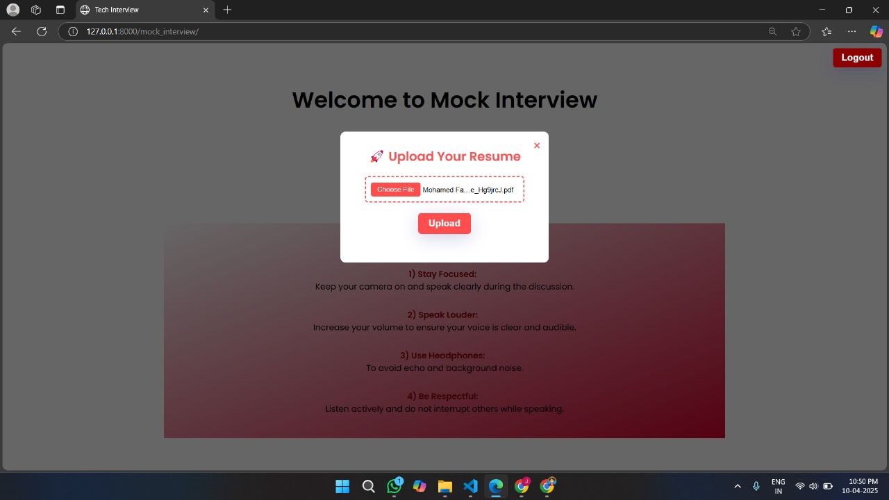

# MockSense Interview System 🎙️🤖

**MockSense** is an AI-powered mock interview platform designed to help candidates **overcome nervousness**, gain **confidence**, and **improve communication skills** through realistic interview simulations. The system uses AI to generate personalized questions, simulate group discussions, assess technical and aptitude skills, and provide real-time feedback.

---

## 🚀 Key Features

### 🧠 Aptitude & Technical Assessments
- Includes **multiple-choice questions** covering core technical subjects and general aptitude.
- Questions are categorized into **easy, medium, and hard** difficulty levels.
- The system evaluates your responses and displays scores along with **performance analysis**.

### 🗣️ GD (Group Discussion) Module
- Simulates a **group discussion** session between the user and **AI participants**.
- The AI engages in meaningful dialogue, analyzes the discussion, and provides detailed **performance feedback**.

### 📄 Resume-Based Question Generation
- Upload your resume (PDF format).
- Leveraging transformer-based NLP models, the system extracts your **skills** and **project experiences**.
- Generates **customized interview questions** based on your resume content, simulating real-world scenarios.

### 🎤 Mock Interview
- Conducts mock interviews with **automatically generated questions** based on your resume.
- After completion, it provides **constructive feedback** to help you identify strengths and areas for improvement.

### 👁️ Intelligent Proctoring System
- Prevents cheating with a **no copy-paste** mechanism.
- Uses **OpenCV** for webcam-based proctoring:
  - Detects if **no face** is present.
  - Alerts on the presence of **multiple faces**.
  - Ensures focus and integrity throughout the interview or assessment.

### 😊 Real-Time Emotion Detection
- Monitors your **facial expressions** using your webcam during the interview.
- Detects emotions like **happiness, nervousness, confusion, etc.**
- Provides **live encouragement messages** to boost your morale and reduce anxiety.

---

## 🛠️ Tech Stack

| Category       | Technologies Used                                 |
|----------------|---------------------------------------------------|
| Backend        | Django (Python)                                   |
| Frontend       | HTML, CSS, JavaScript                             |
| NLP & AI       | Transformers (Hugging Face)                       |
| Computer Vision| OpenCV                                            |
| Resume Parsing | Custom resume parser + transformer-based QA       |
| Emotion Feedback | Expression analysis + live response generator   |

---

## 📸 Screenshots

### Home


### Online Assessments


### Resume Upload


### Mock Interview Session


### Proctoring and Alerts


### Emotion Detection


---


## ⚙️ Getting Started

### Step 1: Clone the Repository
```bash
git clone https://github.com/Fayash30/MockSense_Interview.git
cd MockSense_Interview
```

### Step 2: Set Up Virtual Environment
```bash
python -m venv venv
source venv/bin/activate   # On Windows: venv\Scripts\activate
```

### Step 3: Install Dependencies
```bash
pip install -r requirements.txt
```

### Step 4: Run Migrations
```bash
python manage.py migrate
```

### Step 5: Start the Development Server
```bash
python manage.py runserver
```

### Step 6: Open in Browser
```
http://127.0.0.1:8000/
```

---

## 🔮 Future Enhancements

- Add **speech tone and pace analysis** to evaluate verbal delivery.
- Enable **multi-language support** for international users.
- Develop an **admin panel** to manage content, users, and feedback insights.

---

## 🤝 Contribution

Contributions are welcome! Feel free to fork the repository and submit a pull request. For major changes, open an issue first to discuss the proposed feature.

---

## 📄 License

This project is licensed under the **MIT License**. See the [LICENSE](LICENSE) file for more details.

---

## 👨‍💻 Authors

This project was developed by a passionate team of final-year IT students:

- **Mohamed Fayash N.**    
  [LinkedIn](www.linkedin.com/in/mohamedfayash) • [GitHub](https://github.com/Fayash30)

- **Ragaswathi M**    
  [LinkedIn](https://www.linkedin.com/in/ragaswathi-m-8b8420269) • [GitHub](https://github.com/swathi8819)

- **Sanmugam H M**  
  [LinkedIn](https://www.linkedin.com/in/sanmugam-hm) • [GitHub](https://github.com/SANMUGAM2004)

- **Sowmiya S**  
  [LinkedIn](https://www.linkedin.com/in/sowmiya-s-69651824a) • [GitHub](https://github.com/sowmiya493)

